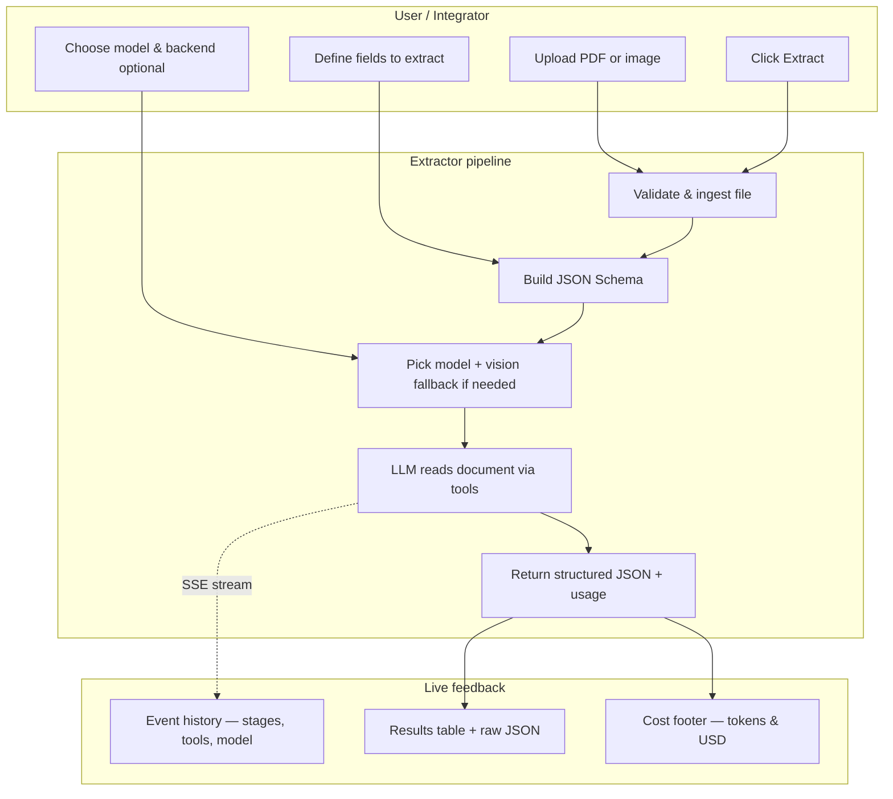
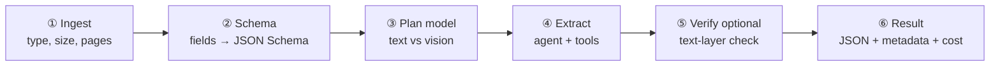
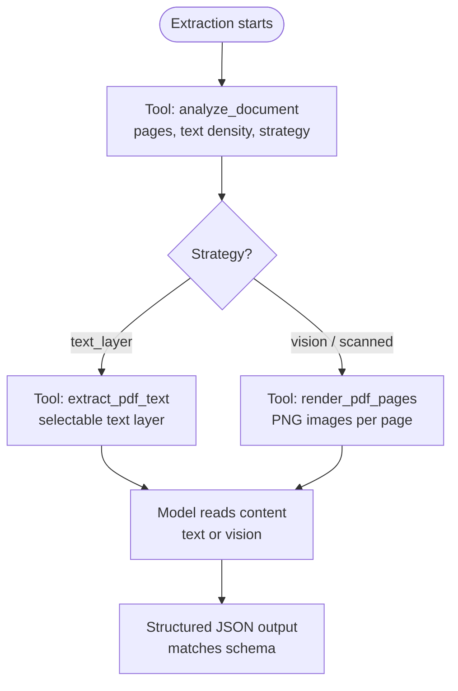
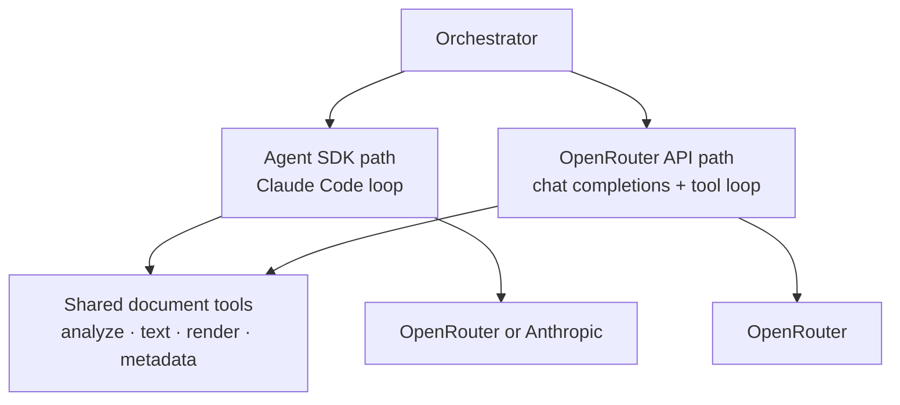
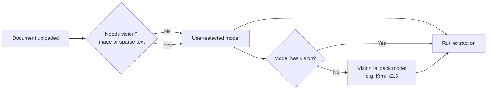

# Structured Doc Agent — Architecture Overview

An agentic document extraction system: PDFs and images in, validated JSON out — with live progress, cost tracking, and production-minded design choices.

This document stays **high-level**. It explains *what* was built and *why*, so you can walk an interviewer through the system without opening the codebase.

---

## The problem

Business documents (invoices, forms, reports) arrive as **PDFs or scans**. Teams need **structured data** — not copy-paste, not a black-box API that hallucinates invoice numbers.

Hard parts:

- **Mixed document types** — some PDFs have selectable text; others are scanned images  
- **Trust** — extracted values must come from the document, not the model’s imagination  
- **Operability** — operators need to see *what the agent is doing* and *what it costs*  
- **Flexibility** — different models, providers, and integration styles (UI, API, CLI)

---

## What I built (elevator pitch)

> *“I built an end-to-end extraction pipeline where a user uploads a document, defines fields in a UI, and an LLM agent **reads the file with tools** before filling a JSON schema. Progress streams live to the browser. I support two LLM backends, multiple models via OpenRouter, automatic vision fallback for scanned PDFs, and unified cost accounting — all behind one orchestrator used by the UI, REST API, and CLI.”*

---

## High-level flow

### 1. User journey (what the interviewer sees in the demo)

**Typical demo path (5 minutes):**

1. Load a **commercial invoice** (text PDF) — fast model, text-layer tools, fields populate in seconds.  
2. Switch to a **scanned PDF** — same field spec; system detects vision need and switches model automatically; agent renders pages and reads visually.  
3. Point at the **event feed** — “Here’s the model in use, here’s `analyze_document`, here’s `render_pdf_pages`, here’s the final cost.”

---

### 2. Pipeline stages (what happens on every run)

| Stage | What happens | LLM used? |
|-------|----------------|-----------|
| **Ingest** | Accept file, enforce size/page limits, detect PDF vs image | No |
| **Schema** | Turn field list into JSON Schema, *or* plan schema from NL prompt, *or* use provided schema | Only for NL prompt mode |
| **Model plan** | If document is scanned/image-only and selected model is text-only → switch to vision model | No (heuristic) |
| **Extract** | Agent analyzes doc, reads content, returns schema-constrained JSON | Yes — main cost |
| **Verify** | Optional: flag values not found in PDF text layer (may still be valid from vision) | No |
| **Result** | Status, data, warnings, token/cost breakdown, which model actually ran | No |

Every entry point (UI, API, CLI) runs **this same pipeline** — no duplicate logic per channel.

---

### 3. How the agent reads a document (the core design)

The model is **not** given the raw file and asked to guess. It follows a **tool-first workflow**, like a human:

**Extraction policy (non-negotiable in prompts):**

- Only extract values **visible** after reading the document  
- Missing or unclear → `null` or `[]`, never invented  
- Copy values **verbatim** from the source  

This is what makes the system **trustworthy** for finance/ops use cases, not just a demo trick.

---

### 4. Dual LLM backend (same tools, two integration styles)

I implemented **two backends** behind one switch — env var, UI toggle, or API option — to show I can work with both **agent frameworks** and **direct provider APIs**:

| Backend | What it demonstrates |
|---------|----------------------|
| **Agent SDK** | MCP tools, structured output, streaming agent events, provider routing via OpenRouter |
| **OpenRouter API** | Hand-rolled tool loop, multimodal tool results (images as data URLs), JSON schema response format |

Same business logic; different integration depth — useful when discussing **when to use an agent framework vs plain HTTP**.

---

### 5. Vision auto-fallback (practical multi-model design)

Users default to a **fast, cheap text model** (e.g. DeepSeek). Scanned PDFs **require vision**. Instead of failing silently or forcing users to understand model capabilities:

The **event feed** states the model actually in use, e.g.  
*“Model: Kimi K2.6 · OpenRouter API (scanned document — switched from DeepSeek V3.2)”*

This shows **sensible defaults + automatic recovery**, not “one model fits all.”

---

## Entry points

| Entry | Audience | What it proves |
|-------|----------|----------------|
| **Demo UI** | Interview, product demo | Full UX: upload, field builder, live SSE feed, results, cost |
| **HTTP API** | Integrations | Sync + streaming endpoints, job polling fallback |
| **CLI** | Automation | Scriptable runs with progress on stderr |

---

## Schema input modes (flexibility for callers)

| Mode | Input | When to use |
|------|--------|-------------|
| **Field spec** | UI-friendly field list (scalars + repeating lists) | Demo, business users, quick integrations |
| **Natural language** | “Extract invoice number, date, line items…” | Exploratory / prompt-driven |
| **JSON Schema** | Full schema document | Power users, strict contracts |

Field spec → schema conversion is **local and deterministic** (no LLM spend for schema).

---

## Observability & cost

**Progress events** unify three sources:

- **Pipeline** — file received, schema ready, model chosen, run complete/failed  
- **Agent** — tool calls, reasoning snippets  
- **Tools** — analyze / extract / render started and completed  

**Cost tracking:**

- Tokens in/out per stage and model  
- USD estimated from a model registry (OpenRouter-accurate; SDK totals not blindly trusted)  
- Displayed in UI footer and returned in API `usage`  

This addresses the interview question: *“How would you operate this in production?”* — you need visibility before you need scale.

---

## What this project demonstrates (talking points)

Use these as **capability anchors** in conversation:

| Area | What I did |
|------|------------|
| **Agentic design** | Tool-using LLM that inspects documents before extracting; strict anti-hallucination policy |
| **Multimodal** | Text-layer PDFs + scanned/image PDFs via page rendering and vision models |
| **System design** | Single orchestrator; thin API/UI/CLI; shared tools across backends |
| **LLM integration** | Claude Agent SDK + direct OpenRouter chat completions; model registry; OpenRouter routing |
| **Real-time UX** | SSE progress stream, event history, error banners, job poll fallback |
| **Data modeling** | Field spec → JSON Schema; nested lists; structured LLM output validation |
| **Pragmatic AI ops** | Vision fallback, cost aggregation, configurable models/backends via env |
| **Quality** | Unit + integration tests; golden PDF fixtures; mocked and live LLM paths |
| **Documentation** | Spec, architecture, runnable demo with sample documents |

---

## Design principles

1. **Ground truth only** — if it’s not in the document after reading, it’s `null`.  
2. **One pipeline** — UI, API, and CLI never diverge.  
3. **Observable runs** — model, backend, and tools are visible in the event feed.  
4. **Right model for the job** — cheap text default; vision when the file requires it.  
5. **Honest failures** — clear errors in UI and API when keys, backends, or parsing fail.

---

## Data in, data out (contract)

**In:** document + `{ field_spec | prompt | schema }` + optional `{ model, backend, budget }`

**Out:**

| Field | Meaning |
|-------|---------|
| `status` | success · needs_review · failed |
| `data` | Extracted JSON |
| `schema_used` | Schema applied to this run |
| `metadata` | Pages, duration, backend, model requested vs used, vision fallback |
| `usage` | Tokens and estimated USD by stage/model |
| `warnings` | e.g. verification notes |

---

## Suggested interview walkthrough (≈5 min)

1. **Problem** — “Teams need structured data from messy PDFs without hallucinations.”  
2. **Architecture** — “One orchestrator, agent with tools, schema-constrained output.”  
3. **Live demo** — text invoice → fast extraction; scanned doc → auto vision model; show event feed + cost.  
4. **Depth hook** — “I also built a second backend on raw OpenRouter API to compare agent SDK vs direct tool loops.”  
5. **Production angle** — “Streaming progress, cost per run, null-not-guess policy, tests on real PDFs.”

---

## Related docs

- [README.md](README.md) — setup and run  
- [SPEC.md](SPEC.md) — detailed product and API specification  
