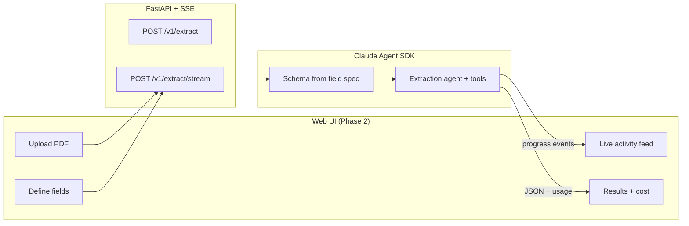
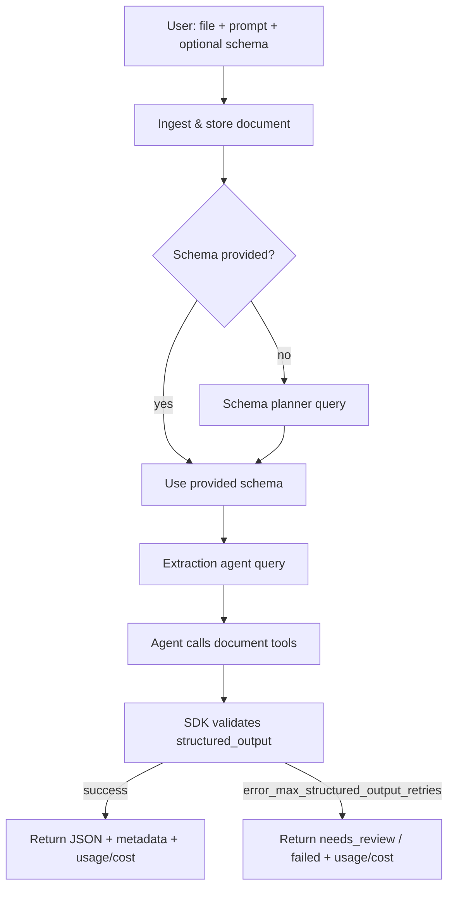
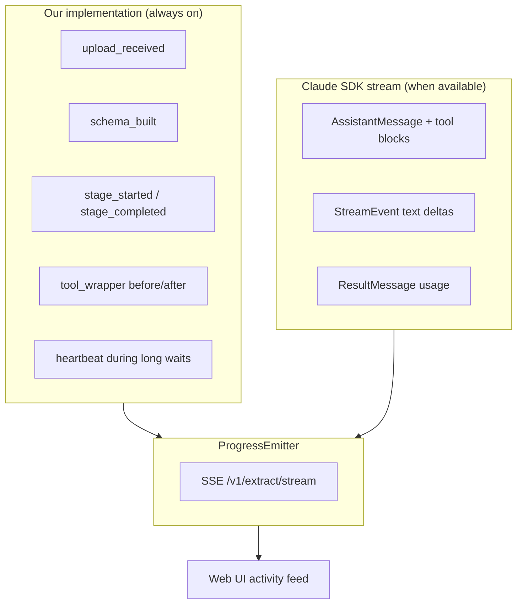

# Spec: Agentic Document Extraction Pipeline

> **Status:** Implemented — this document is the **original design spec** (historical reference).
>
> The shipped system differs in several ways: **OpenRouter routing**, a **multi-model registry**, **dual LLM backends** (Agent SDK + OpenRouter API), and **vision auto-fallback**. For the current architecture, see **[ARCHITECTURE.md](ARCHITECTURE.md)**.

## Vision

Structured Doc Agent is a **production-minded agentic extraction system** — schema-flexible, observable, and designed for real document workflows (not a single-domain parser).

**Core user flow:**

1. User uploads any PDF (invoice, receipt, form, report).
2. User defines **what to extract** — a few single fields, or a **repeating list** (e.g. line items with description, quantity, total — but fields can be anything).
3. An LLM agent reads the document, picks tools (text layer vs page rendering), and returns validated JSON.
4. The UI shows **live progress** — which stage is running, which tools the agent called, tokens/cost accumulating.
5. Results render as a clean table (scalar fields + expandable list rows) with a cost summary at the end.



**Phased delivery:**

| Phase | Goal | Outcome |
|-------|------|---------|
| **Phase 1** | Backend pipeline — API, agent, tools, usage/cost | Runnable engine via API and CLI |
| **Phase 2** | Web UI — upload, field builder, live feed, results | Full product experience in the browser |

Phase 1 must expose a **streaming API** so Phase 2 can show live progress without rework.

---

## Objective

Build a **robust, schema-flexible extraction pipeline** where a user submits any **PDF** (single or multi-page) or **image** and defines what to extract — as natural language, a **field spec** (UI-friendly), or raw JSON Schema. A **Claude Agent SDK** agent returns **validated JSON** matching that definition.

This is a **general-purpose extractor** — not locked to a single domain schema (invoices, transport orders, forms, etc.).

### User stories

**Core extraction**

1. As a user, I upload a PDF or image and describe fields to extract in plain English, and receive structured JSON.
2. As a user, I define extraction fields in a **structured field spec** — scalar fields (invoice number, date) and **repeating groups** (list of items, each with N sub-fields) — without writing JSON Schema by hand.
3. As a user, I can optionally pass a JSON Schema so output shape is strictly enforced.
4. As a user, scanned/image-only PDFs work as reliably as text-layer PDFs because the agent can render pages and inspect them.

**Engineering**

5. As an engineer, I can run the same pipeline via CLI and HTTP API with identical behavior.
6. As an engineer, failed extractions return a clear status (`success`, `partial`, `needs_review`, `failed`) with diagnostic metadata — never unvalidated JSON marked as success.
7. As a user or engineer, every completed run shows **token usage and estimated cost** broken down by stage and model (Haiku vs Sonnet).
8. As an engineer, I can **select which model** runs each stage — Haiku for speed/cost, Sonnet for accuracy — via env vars, CLI flags, or API options.

**Web UI (Phase 2)**

9. As a user, I drag-and-drop a PDF and visually add fields: single values or a **repeating list** with custom sub-columns.
10. As a user, I watch a **live activity panel** while extraction runs — stages, tool calls, partial progress — not just a loading spinner.
11. As a user, I see extracted data in a readable **results view** (key-value for scalars, table for lists) plus total tokens and cost.
12. As a user, I can follow the agent's reasoning path (which tools, which pages) in the activity feed.

### What "agentic" means here

Not a single LLM call. The **Claude Agent SDK** runs a tool-using agent that:

1. Ingests the document
2. Analyzes it (text density, page count, type)
3. Chooses a parse strategy (text layer vs rendered pages)
4. Extracts requested fields via multi-turn tool use
5. Returns SDK-validated structured JSON via `output_format`



---

## Decisions (locked)

| Topic | Decision |
|--------|----------|
| **Agent runtime** | [Claude Agent SDK (Python)](https://code.claude.com/en/agent-sdk/python) — `claude-agent-sdk` |
| **Auth** | `ANTHROPIC_API_KEY` (API key from Claude Console) |
| **Structured output** | SDK `output_format` with JSON Schema → `ResultMessage.structured_output` |
| **Custom capabilities** | In-process MCP tools via `@tool` + `create_sdk_mcp_server` |
| **LLM routing** | Anthropic models only (no LiteLLM in v1) |
| **Primary interface (Phase 1)** | REST API (FastAPI) + CLI wrapper |
| **Web UI (Phase 2)** | Simple web app — upload, field builder, live feed, results |
| **Schema input** | **Field spec** (UI-friendly, default for demo) **or** NL prompt **or** JSON Schema |
| **Live progress** | Dual-source SSE — pipeline + agent + tool events; L1–L4 fallbacks |
| **Documents** | Single document per request in v1 |
| **Max document size** | 50 pages / 25 MB |
| **Models (v1)** | **Haiku** and **Sonnet** only — selectable per stage |
| **Usage & cost** | Always returned at end of every run (success or failure) |

### Environment variables

```bash
ANTHROPIC_API_KEY=sk-ant-...

# Model selection — Haiku (fast/cheap) or Sonnet (accurate) per stage
EXTRACTOR_MODEL=claude-sonnet-4-6              # extraction agent (default: Sonnet)
EXTRACTOR_SCHEMA_MODEL=claude-haiku-4-5          # schema planner (default: Haiku)

# Optional: override pricing table for cost estimates (USD per 1M tokens: input, output)
ANTHROPIC_PRICING_JSON='{"claude-haiku-4-5":{"0":1.0,"1":5.0},"claude-sonnet-4-6":{"0":3.0,"1":15.0}}'

EXTRACTOR_MAX_PAGES=50
EXTRACTOR_MAX_FILE_MB=25
```

Model IDs are placeholders — set to current Anthropic IDs at implementation time.

**Model selection guidance:**

| Use case | Recommended model | Why |
|----------|-------------------|-----|
| Schema planner | Haiku | Single-turn, low complexity |
| Simple extraction (1 page, few fields) | Haiku | Cost-efficient |
| Multi-page PDFs, tables, scanned docs | Sonnet | Higher accuracy, tool-heavy |
| Complex nested schemas | Sonnet | Better structured output compliance |

Callers override defaults per request via CLI flags or API `options.model` / `options.schema_model`.

---

## ASSUMPTIONS

1. **Runtime:** Python 3.11+ (venv, conda, or uv).
2. **Purpose:** Production-minded document extraction — reliability, observability, and schema flexibility matter.
3. **Input (Phase 1):** Local file upload — PDF and common images (PNG, JPG, JPEG, WEBP, TIFF).
4. **Field definition:** UI field spec (scalar + repeating lists) is the primary path; NL prompt is secondary.
5. **Output:** JSON matching field spec — scalars + arrays; field-level provenance deferred to a future release.
6. **Documents:** Stored transiently in `storage/uploads/` during processing; deleted after TTL (24h).
7. **Secrets:** Never committed; API keys from env / `.env`.
8. **Headless operation:** API and CLI run without interactive permission prompts.
9. **Parsing:** PDF text layer + vision fallback (PyMuPDF render), exposed as agent tools.

→ Correct assumptions before implementation if any are wrong.

---

## Why Claude Agent SDK

| Capability | SDK provides | We implement |
|------------|--------------|--------------|
| Agent loop | `query()` streams messages until done | — |
| Tool execution | Built-in + custom MCP tools | Document parsing tools |
| Structured JSON | `output_format` + auto-retry on schema mismatch | Target schema (from prompt or user) |
| Auth | `ANTHROPIC_API_KEY` | Env/config loading |
| Permissions | `permission_mode` for headless runs | Scoped tool allowlist |
| Usage & cost | `ResultMessage.total_cost_usd`, `usage`, `model_usage` per `query()` | Accumulate across stages; format for API/CLI |
| Live progress | Dual-source: **pipeline events** (ours) + **agent events** (Claude SDK stream) | `ProgressEmitter` → SSE; fallback tiers if SDK stream unavailable |

### What we do NOT build in v1

| Removed | Replaced by |
|---------|-------------|
| LiteLLM proxy | `ANTHROPIC_API_KEY` |
| Custom orchestrator / repair agent | SDK agent loop + structured output retries |
| Manual JSON fence parsing | `ResultMessage.structured_output` |
| Separate repair stage | SDK re-prompts on schema mismatch |

Optional thin post-validation (Pydantic normalizers for amounts, dates) may run after SDK validation.

---

## Tech Stack

| Layer | Choice |
|--------|--------|
| Language | Python ≥ 3.11 |
| Agent | `claude-agent-sdk` |
| Auth | `ANTHROPIC_API_KEY` |
| API | FastAPI + Uvicorn |
| CLI | `extractor` entry point |
| Validation | SDK structured output + optional Pydantic post-parse |
| PDF text | `pypdf` |
| PDF render | `pymupdf` (fitz) |
| Images | Direct input (PNG, JPG, JPEG, WEBP, TIFF) |
| Testing | `pytest` |
| Web UI (Phase 2) | React or plain HTML/JS — served by FastAPI static files or Vite dev server |
| Real-time updates | Server-Sent Events (SSE) from FastAPI |
| Packaging | `pyproject.toml`, package name `extractor` |

### Model tiers (Haiku / Sonnet)

| Role | Default model | Configurable via | Purpose |
|------|---------------|------------------|---------|
| Schema planner | Haiku | `EXTRACTOR_SCHEMA_MODEL`, `--schema-model`, API `options.schema_model` | Turn NL prompt → JSON Schema |
| Extraction agent | Sonnet | `EXTRACTOR_MODEL`, `--model`, API `options.model` | Multi-turn tool use + structured extraction |

Both stages accept any supported Anthropic model ID, but v1 is optimized and tested for **Haiku** and **Sonnet** only.

---

## Commands

Requires Python 3.11+ with dependencies installed (`pip install -e ".[dev]"`).

```bash
# One-time setup
cd structured-doc-agent
python -m venv .venv && source .venv/bin/activate
pip install -e ".[dev]"

# Run API server
uvicorn extractor.api:app --reload --port 8000

# CLI extraction (NL prompt) — defaults: Haiku planner, Sonnet extractor
extractor run \
  --file ./storage/Bottles-CI.pdf \
  --prompt "Extract invoice number, date, vendor name, and all line items with description, quantity, and total" \
  --output result.json

# CLI with explicit schema and model overrides (Haiku for both = cheapest)
extractor run \
  --file ./samples/receipt.png \
  --schema ./schemas/receipt.json \
  --model claude-haiku-4-5 \
  --output result.json

# CLI — Sonnet for both stages (highest accuracy)
extractor run \
  --file ./storage/Bottles-CI.pdf \
  --prompt "Extract all fields from this commercial invoice" \
  --model claude-sonnet-4-6 \
  --schema-model claude-sonnet-4-6 \
  --output result.json

# Tests
pytest -q
pytest -q -m integration   # requires ANTHROPIC_API_KEY
```

---

## Project Structure

```
extractor/
  SPEC.md
  pyproject.toml
  src/extractor/
    __init__.py
    api.py                  # FastAPI routes + SSE stream endpoint
    cli.py                  # CLI entry point
    types.py                # ExtractionRequest, ExtractionResult, UsageSummary, FieldSpec
    cost.py                 # token aggregation + USD estimates (reuse pipeline pattern)
    events.py               # ProgressEvent, ProgressEmitter, SDK → event mapping, fallbacks
    jobs.py                 # In-memory job store for L4 poll fallback
    schema_builder.py       # FieldSpec → JSON Schema conversion
    agent/
      extraction.py         # main query() + ClaudeAgentOptions
      schema_planner.py     # NL → JSON Schema query (when no field spec)
      prompts.py            # system prompts
    tools/
      document_tools.py     # @tool definitions
      mcp_server.py         # create_sdk_mcp_server wiring
    parsing/
      pdf.py                # text layer + page rendering
      image.py              # image loading/normalization
      registry.py           # extension → parser routing
    logger.py
  ui/                       # Phase 2 — demo web app
    index.html              # or React/Vite app
    app.js                  # upload, field builder, SSE consumer, results table
    styles.css
  storage/
    uploads/                # transient uploaded files
  tests/
    test_document_tools.py
    test_schema_builder.py
    test_schema_planner.py
    test_extraction_agent.py
    test_events.py          # emitter, SDK mapping, fallback tiers
    test_api.py
    fixtures/               # sample PDFs/images
```

---

## Agent Architecture

### Phase 1 flow

```
1. POST /v1/extract or /v1/extract/stream (file + field_spec | prompt | schema)
2. Save file → storage/uploads/{job_id}/
3. Build JSON Schema:
     field_spec → schema_builder (no LLM)
     prompt     → schema_planner (Haiku query)
     schema     → use as-is
4. extract_document(path, spec, schema)   [agent + tools + output_format]
5. Stream progress events (if SSE)
6. Aggregate usage/cost
7. Return structured_output + metadata + usage
```

Each `query()` call emits a `ResultMessage` with `total_cost_usd`, `usage`, and `model_usage`. The pipeline **accumulates** these across all stages before returning.

### Extraction agent (core SDK call)

```python
import asyncio
from claude_agent_sdk import query, ClaudeAgentOptions, ResultMessage

async def extract_document(
    *,
    document_path: str,
    prompt: str,
    schema: dict,
    model: str,
) -> tuple[dict, UsageSummary]:
    options = ClaudeAgentOptions(
        model=model,
        system_prompt=EXTRACTION_SYSTEM_PROMPT,
        allowed_tools=[
            "mcp__extractor__analyze_document",
            "mcp__extractor__extract_pdf_text",
            "mcp__extractor__render_pdf_pages",
            "mcp__extractor__get_document_metadata",
        ],
        mcp_servers={"extractor": document_mcp_server},
        permission_mode="dontAsk",
        output_format={"type": "json_schema", "schema": schema},
    )

    async for message in query(
        prompt=f"Document: {document_path}\n\nExtract: {prompt}",
        options=options,
    ):
        if isinstance(message, ResultMessage):
            usage = usage_from_result(message, stage="extraction", model=model)
            if message.subtype == "success" and message.structured_output:
                return (
                    {"status": "success", "data": message.structured_output},
                    usage,
                )
            if message.subtype == "error_max_structured_output_retries":
                return (
                    {"status": "needs_review", "error": "schema_validation_exhausted"},
                    usage,
                )

    return ({"status": "failed", "error": "no_result"}, UsageSummary.empty())
```

After both stages complete, merge usage summaries:

```python
total_usage = merge_usage([schema_planner_usage, extraction_usage])
# total_usage includes input_tokens, output_tokens, cost_usd, by_stage, by_model
```

### Custom tools (in-process MCP)

| Tool | Purpose | Side effects |
|------|---------|--------------|
| `analyze_document` | Page count, text density, file type, recommended strategy | Read-only |
| `extract_pdf_text` | Text layer via `pypdf` | Read-only |
| `render_pdf_pages` | Render page(s) to PNG via PyMuPDF | Read-only |
| `get_document_metadata` | MIME, size, dimensions | Read-only |

Tools are defined with `@tool`, wrapped in `create_sdk_mcp_server`, and registered via `mcp_servers` in `ClaudeAgentOptions`.

**Parsing strategy (inside tools):**

1. **PDF:** Try `pypdf` text extraction first.
2. If text density < threshold (e.g. 50 chars/page avg) → agent calls `render_pdf_pages`.
3. **Images:** Passed directly; agent inspects via rendered content or file path context.
4. **Tables:** Preserve structure in tool output (markdown-like tables).

Reuse the same parsing approach (text layer + vision fallback) inside agent tools.

### Schema handling

Three input modes (all converge to JSON Schema before extraction):

**Mode A — Field spec (default for demo UI):**

User defines fields visually or via JSON. Supports **scalar fields** and **repeating lists**.

```json
{
  "fields": [
    { "name": "invoice_number", "label": "Invoice Number", "type": "string" },
    { "name": "invoice_date", "label": "Date", "type": "string" },
    {
      "name": "line_items",
      "label": "Line Items",
      "type": "array",
      "item_fields": [
        { "name": "description", "label": "Description", "type": "string" },
        { "name": "quantity", "label": "Qty", "type": "number" },
        { "name": "total", "label": "Total", "type": "number" }
      ]
    }
  ]
}
```

`schema_builder.py` converts this to JSON Schema for `output_format`. No LLM call needed for schema — faster and deterministic (good for demo reliability).

**Example output from the spec above:**

```json
{
  "invoice_number": "INV-1042",
  "invoice_date": "2024-03-15",
  "line_items": [
    { "description": "Widget A", "quantity": 2, "total": 50.0 },
    { "description": "Widget B", "quantity": 1, "total": 30.0 }
  ]
}
```

**Mode B — Natural language:**

Schema planner — lightweight `query()` (Haiku, no tools) turns user prompt into JSON Schema.

**Mode C — User-provided JSON Schema:**

Skip planner and field spec; pass schema directly to `output_format`.

**Default priority:** Mode A (field spec) for the web UI — deterministic schema, predictable runs. Mode B as quick extract fallback.

---

## Live Progress (SSE) — Dual-Source with Fallbacks

Progress comes from **two independent sources** merged into one activity feed. The UI always shows *something* useful — even if Claude SDK streaming is limited or unavailable.



### Design principle

| Source | Reliability | What it tells the user |
|--------|-------------|------------------------|
| **`pipeline`** (ours) | **Always works** — we control it | Which stage we're in, file validated, schema built, job done |
| **`agent`** (Claude SDK) | Best-effort — depends on SDK message stream | Which tools Claude chose, reasoning snippets, token stream |
| **`tool`** (ours, inside MCP handlers) | **Always works** when agent calls our tools | Page 2 of 5 rendered, 1,240 chars extracted |

The UI renders all three with a small source badge so operators can see *pipeline orchestration* and *agent decisions* separately.

---

### ProgressEmitter (central hub)

All progress flows through one async emitter. Pipeline code, SDK adapter, and tool handlers publish to it; the API SSE handler subscribes.

```python
# events.py
@dataclass
class ProgressEvent:
    type: str
    source: Literal["pipeline", "agent", "tool"]
    stage: str | None          # e.g. "ingest", "schema", "extraction"
    message: str               # human-readable line for UI
    detail: dict | None        # optional structured payload
    timestamp: str

class ProgressEmitter:
    async def emit(self, event: ProgressEvent) -> None: ...
    async def subscribe(self) -> AsyncIterator[ProgressEvent]: ...
```

Implement as an in-memory async queue per job (`job_id`). No external Redis required for v1.

---

### Source 1 — Pipeline events (our implementation)

**Always emitted.** These are deterministic milestones we control — never depend on Claude.

| Event `type` | `stage` | When | Example `message` |
|--------------|---------|------|-------------------|
| `run_started` | — | Job accepted | "Starting extraction…" |
| `file_received` | `ingest` | Upload saved | "Received Bottles-CI.pdf (248 KB)" |
| `file_validated` | `ingest` | Size/page checks pass | "Validated: 2 pages, PDF" |
| `schema_build_started` | `schema` | Before schema work | "Building extraction schema…" |
| `schema_built` | `schema` | Field spec → JSON Schema | "Schema ready: 4 fields + line_items list" |
| `schema_plan_started` | `schema` | Before Haiku planner (NL mode) | "Planning schema from prompt…" |
| `schema_planned` | `schema` | Planner returned schema | "Schema planned: 6 fields" |
| `stage_started` | `extraction` | Before agent `query()` | "Extracting data with Sonnet…" |
| `stage_completed` | `*` | After stage finishes | "Extraction complete (7.3s)" |
| `usage_ready` | — | Cost aggregated | "Total: $0.051 · 12,450 tokens" |
| `run_completed` | — | Final success | (includes full `data` + `usage`) |
| `run_failed` | — | Unrecoverable error | "Extraction failed: …" |
| `heartbeat` | `*` | Long silence (>3s) | "Still working… (rendering pages)" |

Pipeline events carry `source: "pipeline"`.

---

### Source 2 — Agent events (Claude SDK stream)

**Best-effort.** Parsed from SDK messages inside `async for message in query(...)`:

| SDK message | Maps to event | `source` |
|-------------|---------------|----------|
| `AssistantMessage` + tool block | `agent_tool_called` | `agent` |
| Tool result in stream | `agent_tool_result` | `agent` |
| `AssistantMessage` + text block | `agent_text` (optional, collapsible) | `agent` |
| `StreamEvent` + `text_delta` | `agent_text_delta` (optional) | `agent` |
| `ResultMessage` | `agent_stage_result` (subtype, partial cost) | `agent` |

Example mapping:

```python
async for message in query(prompt=..., options=options):
    if isinstance(message, AssistantMessage):
        for block in message.content:
            if hasattr(block, "name"):  # tool use
                await emitter.emit(ProgressEvent(
                    type="agent_tool_called",
                    source="agent",
                    stage="extraction",
                    message=f"Claude calling {block.name}",
                    detail={"tool": block.name, "input": block.input},
                ))
    elif isinstance(message, StreamEvent):
        # optional token streaming to UI
        ...
    elif isinstance(message, ResultMessage):
        await emitter.emit(ProgressEvent(
            type="agent_stage_result",
            source="agent",
            stage="extraction",
            message=f"Agent finished ({message.subtype})",
            detail={"subtype": message.subtype, "cost_usd": message.total_cost_usd},
        ))
```

Enable SDK streaming:

```python
ClaudeAgentOptions(
    include_partial_messages=True,  # StreamEvent for text deltas (optional)
    ...
)
```

Agent events carry `source: "agent"`.

---

### Source 3 — Tool events (our MCP tool wrappers)

**Always emitted when tools run** — even if SDK does not surface tool calls clearly. Wrap each `@tool` handler:

```python
@tool("render_pdf_pages", "Render PDF pages as images", {...})
async def render_pdf_pages(args: dict) -> dict:
    pages = args["page_numbers"]
    await emitter.emit(ProgressEvent(
        type="tool_started",
        source="tool",
        stage="extraction",
        message=f"Rendering {len(pages)} page(s)…",
        detail={"tool": "render_pdf_pages", "pages": pages},
    ))
    result = _render_pages_impl(args)
    await emitter.emit(ProgressEvent(
        type="tool_completed",
        source="tool",
        stage="extraction",
        message=f"Rendered {len(pages)} page(s)",
        detail={"tool": "render_pdf_pages", "bytes": len(result)},
    ))
    return result
```

This guarantees the UI shows "Rendering page 2" even if agent-level tool events are missing.

Tool events carry `source: "tool"`.

---

### Unified event schema (SSE payload)

Every event sent to the UI uses the same shape:

```json
{
  "type": "tool_completed",
  "source": "tool",
  "stage": "extraction",
  "message": "Rendered 2 page(s)",
  "detail": {"tool": "render_pdf_pages", "pages": [1, 2]},
  "timestamp": "2026-05-21T12:00:01Z"
}
```

Final event is always `run_completed` or `run_failed` with full result + usage.

---

### Fallback strategy (if Claude progress unavailable)

Progress must **never be a blank spinner**. Degrade gracefully in tiers:

| Tier | Condition | What the UI shows | How |
|------|-----------|-------------------|-----|
| **L1 — Full** | SDK stream works | Pipeline + agent + tool events | Default path |
| **L2 — Agent-degraded** | SDK stream partial (no tool blocks / no StreamEvent) | Pipeline + **tool wrapper** events only | Tool wrappers always emit; skip agent mapping |
| **L3 — Pipeline-only** | SDK `query()` throws or returns no stream | Pipeline milestones + heartbeat | Catch SDK errors; emit `stage_started` → heartbeat every 3s → `stage_completed` or `run_failed` |
| **L4 — Poll fallback** | SSE connection drops or browser lacks EventSource | Poll `GET /v1/jobs/{job_id}` | Job store returns `{status, stage, message, progress_pct}` updated by pipeline |

**Implementation rules:**

1. **Pipeline events are mandatory** — never gated on Claude.
2. **Tool wrapper events are mandatory** — emit before/after every `@tool` call.
3. **Agent events are optional** — wrap SDK parsing in try/except; log and continue on parse failure.
4. **Heartbeat** — if no event for 3s during extraction, emit `heartbeat` with current `stage`.
5. **Detect L2 automatically** — if extraction `query()` completes with zero `agent_*` events parsed, log warning and rely on tool + pipeline events (demo still looks good).
6. **CLI fallback** — print pipeline + tool lines to stderr with `[pipeline]` / `[tool]` / `[agent]` prefix when not using SSE.

```python
async def run_extraction(..., emitter: ProgressEmitter) -> ExtractionResult:
    await emitter.emit(pipeline_event("run_started", "Starting extraction…"))
    try:
        await _ingest_and_validate(..., emitter)      # pipeline
        schema = await _build_schema(..., emitter)    # pipeline
        result = await _extract_with_agent(..., emitter)  # pipeline + agent + tool
    except AgentStreamError:
        log.warning("agent stream unavailable; pipeline-only mode")
        result = await _extract_with_agent_pipeline_only(..., emitter)  # L3
    await emitter.emit(pipeline_event("run_completed", ...))
    return result
```

**L4 poll endpoint (Phase 1):**

```
GET /v1/jobs/{job_id}
→ { "status": "running", "stage": "extraction", "message": "Rendering 2 page(s)…", "progress_pct": 60 }
```

Updated by pipeline on every `ProgressEvent`. UI tries SSE first; on disconnect, falls back to poll every 1s.

---

### API endpoints

| Endpoint | Purpose |
|----------|---------|
| `POST /v1/extract` | Synchronous — returns full result when done (CLI, scripts) |
| `POST /v1/extract/stream` | SSE — streams all progress events, ends with `run_completed` |
| `GET /v1/jobs/{job_id}` | Poll fallback — current stage + message (L4) |

Both POST endpoints accept: `file`, `field_spec` | `prompt` | `schema`, `options`.

---

### UI activity feed (Phase 2)

Shows **both** our stages and Claude's actions, with source badges:

```
┌──────────────────────────────────────────────────────────┐
│  Live Activity                                            │
├──────────────────────────────────────────────────────────┤
│  [pipeline] ✓ Received Bottles-CI.pdf (248 KB)           │
│  [pipeline] ✓ Validated: 2 pages                         │
│  [pipeline] ✓ Schema ready: 4 fields + line_items        │
│  [pipeline] ● Extracting with Sonnet…                     │
│  [agent]    → Claude chose analyze_document               │
│  [tool]     → Analyzed 2 pages (text sparse)              │
│  [agent]    → Claude chose render_pdf_pages               │
│  [tool]     → Rendering pages 1–2…                        │
│  [tool]     ✓ Rendered 2 pages                            │
│  [pipeline] ✓ Extraction complete (7.3s)                   │
│  [pipeline]   Total: $0.051 · 12,450 tokens               │
└──────────────────────────────────────────────────────────┘
```

If agent events missing (L2/L3), feed still shows pipeline + tool lines — demo remains credible.

Parallel tool calls show as grouped entries. Heartbeat lines fade or use a subtle pulse animation.

---

## Web UI (Phase 2)

Simple, polished single-page app — no auth, no accounts. Optimized for **quick onboarding and daily use**.

### Screens / sections (one page)

1. **Upload zone** — drag-and-drop PDF/image; show filename + page count after analyze.
2. **Field builder** — add scalar fields or a "Repeating list" group with sub-fields.
3. **Model picker** — Haiku / Sonnet toggle (with brief cost/speed hint).
4. **Extract button** — starts SSE stream.
5. **Activity feed** — live progress panel (left or sidebar).
6. **Results panel** — scalar fields as key-value; lists as table; raw JSON toggle.
7. **Cost footer** — total tokens + USD, by stage/model.

### Field builder UX

| Control | Behavior |
|---------|----------|
| "+ Add field" | Adds scalar field (name, label, type: string/number/date) |
| "+ Add list" | Adds repeating group with nested sub-fields |
| Preset templates | "Invoice" (number, date, vendor, line items) — one-click demo setup |
| Field spec JSON | Advanced toggle to edit raw `field_spec` JSON |

### Example workflow

1. Load preset "Invoice" template → show field spec.
2. Upload `Bottles-CI-text.pdf`.
3. Run Extract → activity feed shows agent analyzing, rendering pages, extracting.
4. Results table populates; expand line items.
5. Review cost footer — model and token usage by stage.
6. (Optional) Switch to NL prompt mode for ad-hoc extraction.

### UI tech (keep it simple)

| Option | Pros | Recommendation |
|--------|------|----------------|
| Plain HTML + vanilla JS | Zero build step, easy to demo | **Start here** for Phase 2 |
| React + Vite | Richer components | Upgrade if time allows |

Serve from FastAPI (`StaticFiles` on `/ui`) so one command runs everything:

```bash
extractor serve --reload --port 8000
# Open http://localhost:8000/ui
```

---

## Usage & Cost Tracking

Every completed run — **success, needs_review, or failed** — must include a `usage` block with token counts and estimated cost. This applies to API responses, CLI stdout, and log summaries.

### Data sources (Claude Agent SDK)

Per `query()` call, read from `ResultMessage`:

| SDK field | Purpose |
|-----------|---------|
| `total_cost_usd` | Client-side cost estimate for this call |
| `usage` | Cumulative tokens: `input_tokens`, `output_tokens`, `cache_read_input_tokens`, `cache_creation_input_tokens` |
| `model_usage` | Per-model breakdown: `inputTokens`, `outputTokens`, `costUSD` |

The SDK computes `total_cost_usd` locally from a bundled price table. Use for **development insight and approximate budgeting** — not authoritative billing. For billing, use the [Anthropic Usage and Cost API](https://platform.claude.com/docs/en/build-with-claude/usage-cost-api).

### Accumulation across stages

Each pipeline stage is a separate `query()` call. Accumulate manually (SDK does not provide session-level totals):

```python
@dataclass
class StageUsage:
    stage: str                    # "schema_planner" | "extraction"
    model_id: str
    input_tokens: int
    output_tokens: int
    cache_read_input_tokens: int
    cache_creation_input_tokens: int
    cost_usd: float
    latency_ms: float

@dataclass
class UsageSummary:
    input_tokens: int
    output_tokens: int
    cache_read_input_tokens: int
    cache_creation_input_tokens: int
    cost_usd: float
    by_stage: dict[str, StageUsage]
    by_model: dict[str, dict]     # from ResultMessage.model_usage

    def to_dict(self) -> dict: ...
```

Reuse the pricing/aggregation pattern from `pipeline/cost.py` (`CostSummary`, `merge_costs`, `format_cost_line`) adapted for SDK `ResultMessage` fields.

### Response shape (`usage` block)

```json
{
  "usage": {
    "input_tokens": 12450,
    "output_tokens": 890,
    "cache_read_input_tokens": 3200,
    "cache_creation_input_tokens": 0,
    "cost_usd": 0.0512,
    "by_stage": {
      "schema_planner": {
        "model_id": "claude-haiku-4-5",
        "input_tokens": 420,
        "output_tokens": 180,
        "cost_usd": 0.0013,
        "latency_ms": 890
      },
      "extraction": {
        "model_id": "claude-sonnet-4-6",
        "input_tokens": 12030,
        "output_tokens": 710,
        "cost_usd": 0.0499,
        "latency_ms": 7310
      }
    },
    "by_model": {
      "claude-haiku-4-5": {
        "input_tokens": 420,
        "output_tokens": 180,
        "cost_usd": 0.0013
      },
      "claude-sonnet-4-6": {
        "input_tokens": 12030,
        "output_tokens": 710,
        "cost_usd": 0.0499
      }
    }
  }
}
```

### CLI output

After JSON result, print a human-readable cost line (always, even on failure):

```text
cost $0.0512 (tokens in=12,450 out=890) | schema_planner/haiku $0.0013 | extraction/sonnet $0.0499
```

Use `--quiet` to suppress the cost line; `--verbose` to include cache token breakdown.

### API request options (model selection)

| Field | Default | Description |
|-------|---------|-------------|
| `options.model` | `EXTRACTOR_MODEL` | Extraction agent model (Sonnet recommended) |
| `options.schema_model` | `EXTRACTOR_SCHEMA_MODEL` | Schema planner model (Haiku recommended) |
| `options.max_budget_usd` | none | Optional SDK budget cap via `ClaudeAgentOptions.max_budget_usd` |

---

## API Design

### `POST /v1/extract`

**Request** (multipart):

| Field | Required | Description |
|-------|----------|-------------|
| `file` | yes | PDF or image binary |
| `field_spec` | one of* | UI-friendly field definition JSON (see Schema handling) |
| `prompt` | one of* | Natural-language extraction instructions |
| `schema` | one of* | Raw JSON Schema string |
| `options` | no | JSON object — `model`, `schema_model`, `max_budget_usd` |

\* Provide exactly one of `field_spec`, `prompt`, or `schema`.

**Response:**

```json
{
  "status": "success",
  "data": {
    "invoice_number": "INV-1042",
    "date": "2024-03-15",
    "line_items": [
      {"description": "Widget A", "quantity": 2, "total": 50.0}
    ]
  },
  "schema_used": {},
  "metadata": {
    "page_count": 3,
    "agent_subtype": "success",
    "duration_ms": 8200,
    "models_used": {
      "schema_planner": "claude-haiku-4-5",
      "extraction": "claude-sonnet-4-6"
    }
  },
  "usage": {
    "input_tokens": 12450,
    "output_tokens": 890,
    "cache_read_input_tokens": 3200,
    "cache_creation_input_tokens": 0,
    "cost_usd": 0.0512,
    "by_stage": {},
    "by_model": {}
  },
  "warnings": []
}
```

The `usage` block is **always present** regardless of `status`.

### `POST /v1/extract/stream`

Same request as `/v1/extract`. Response is `text/event-stream` with unified `ProgressEvent` objects from **pipeline**, **agent**, and **tool** sources (see Live Progress section). Final event is always `run_completed` or `run_failed` with full result + usage. UI may fall back to `GET /v1/jobs/{job_id}` if SSE disconnects.

### Status values

| Status | Meaning |
|--------|---------|
| `success` | SDK returned validated `structured_output` |
| `partial` | Some fields extracted; others null/missing (future — requires schema design) |
| `needs_review` | `error_max_structured_output_retries` from SDK |
| `failed` | Document unreadable, no result, or unrecoverable error |

### SDK subtype → API status mapping

| SDK `ResultMessage.subtype` | API `status` |
|-----------------------------|--------------|
| `success` + `structured_output` | `success` |
| `error_max_structured_output_retries` | `needs_review` |
| other errors / no result | `failed` |

---

## Permission & Security

For headless API/CLI operation:

```python
ClaudeAgentOptions(
    permission_mode="dontAsk",
    allowed_tools=[
        "mcp__extractor__analyze_document",
        "mcp__extractor__extract_pdf_text",
        "mcp__extractor__render_pdf_pages",
        "mcp__extractor__get_document_metadata",
    ],
)
```

**Never** expose `Bash`, `Edit`, `Read`, or `WebSearch` in production — the agent must only access uploaded documents via scoped custom tools.

- Sanitize/delete uploaded files after TTL (24h)
- Enforce max file size and page count before agent run
- Return structured errors to API clients; never raw stack traces

---

## Code Style

Follow project conventions in `AGENTS.md`:

```python
from extractor.logger import get_logger

log = get_logger(__name__)

def extract_pdf_text(path: Path) -> str:
    """Return concatenated text from all PDF pages."""
    ...
```

- Absolute imports (`from extractor.parsing.pdf import ...`)
- Type hints on public functions
- Functions over classes unless stateful
- Module-level loggers via `extractor.logger`

---

## Testing Strategy

| Level | What | Notes |
|-------|------|-------|
| Unit | Document tools, PDF routing, schema planner (mocked) | `pytest`, no API key |
| Unit | Usage aggregation from mocked `ResultMessage` | `pytest`, no API key |
| Integration | End-to-end with real SDK on fixture docs | `pytest -m integration` |
| Contract | API request/response shape | FastAPI TestClient |

**Coverage targets (v1):**

- Parsing/tools modules: ≥ 90%
- Agent wrapper: ≥ 80% with mocked `query()`
- At least 5 fixture documents: text PDF, scanned PDF, multi-page PDF, invoice image, receipt photo

**Fixture available:** `storage/Bottles-CI.pdf`

---

## Boundaries

**Always:**

- Validate all output via SDK `output_format` before returning `success`
- Log stage transitions and agent subtype
- Include `usage` (tokens + cost) in every API/CLI response, including failures
- Emit **pipeline progress events** on every run — never depend on Claude for basic stage visibility
- Wrap every MCP tool with before/after progress events
- Scope agent tools to uploaded documents only
- Run tests before commits

**Ask first:**

- Adding built-in SDK tools (`Bash`, `Read`, etc.) to allowlist
- Persisting extraction results to a database
- Supporting new file types (`.docx`, `.eml`, `.xlsx`)
- Changing retry/cost limits or model defaults

**Never:**

- Commit secrets or `.env` files
- Return unvalidated LLM output as `success`
- Send documents to LLM without size/page limits
- Store user documents permanently without explicit opt-in

---

## Success Criteria

| Criterion | Target |
|-----------|--------|
| **Input coverage** | PDF (1–50 pages) and PNG/JPG/JPEG/WEBP/TIFF |
| **User intent** | NL prompt produces valid JSON without user writing schema |
| **Schema override** | Optional JSON Schema strictly enforced via `output_format` |
| **Scanned PDFs** | Agent uses `render_pdf_pages` when text is sparse |
| **Validation** | 100% of `success` responses have SDK-validated `structured_output` |
| **Headless** | No interactive permission prompts in API/CLI |
| **Latency** | Single-page p95 < 20s; 10-page p95 < 90s |
| **Usage reporting** | 100% of runs return `usage` with tokens and `cost_usd` |
| **Model selection** | Haiku and Sonnet selectable per stage via env, CLI, or API |
| **Cost breakdown** | `by_stage` and `by_model` populated when multiple stages/models used |
| **Field spec** | Scalar + array fields convert to valid JSON Schema; extraction succeeds on demo PDF |
| **Live progress (Phase 1 API)** | SSE emits pipeline + tool events always; agent events when SDK allows |
| **Progress fallback** | UI never blank — L3 pipeline-only + heartbeat works without agent stream |
| **Poll fallback (L4)** | `GET /v1/jobs/{job_id}` returns stage/message if SSE drops |
| **Web UI (Phase 2)** | Upload → define fields → live feed → results + cost in a typical session |

---

## Phased Scope

### Phase 1 — Backend (build first)

| In scope | Out of scope |
|----------|--------------|
| Agent + document tools | Full UI |
| Field spec → JSON Schema | Auth / multi-user |
| REST API + SSE stream + job poll endpoint | Batch processing |
| CLI | Mobile layout |
| Usage/cost on every run | |

### Phase 2 — Web UI

| In scope | Out of scope |
|----------|--------------|
| Upload + field builder | User accounts |
| Live activity feed (SSE client) | Production deployment |
| Results table + cost footer | Complex theming |
| Invoice preset template | Many preset templates |

### Future releases

| Feature | Notes |
|---------|-------|
| Batch folder processing | |
| `.docx`, `.eml` support | |
| Provenance (page, confidence per field) | |
| S3 / blob storage | |
| Human review queue | |

---

## Design lineage

Structured Doc Agent is **schema-dynamic and agent-driven** — callers define fields per document type rather than shipping a fixed domain schema.

Prior art in document parsing (text layer + vision fallback, cost aggregation patterns) informed the tool design; this codebase is self-contained.

---

## Open Questions

1. **UI framework:** Plain HTML/JS (fastest for demo) or React from the start?
2. **Schema planner:** Still needed when user uses field spec, or only for NL prompt mode?
3. **Provenance:** Show page numbers in activity feed in Phase 2, or defer?
4. **Hosting:** Local development, Docker, or deploy to Render / Railway / Fly.
5. **Fixtures:** Additional sample docs + expected JSON beyond `Bottles-CI.pdf`?
6. **Budget cap:** Enable `max_budget_usd` by default, or only when caller opts in?
7. **Preset templates:** Invoice only, or 2–3 (receipt, form) for demo variety?
8. **Agent text in UI:** Show Claude reasoning (`agent_text`) in feed, or hide by default for cleaner demo?

---

## Next Steps (after spec approval)

1. **Plan** — Phase 1 task breakdown (backend first, SSE-ready)
2. **Tasks** — discrete units with acceptance criteria
3. **Implement Phase 1** — `pyproject.toml` → field spec builder → tools → agent → API + SSE → CLI
4. **Implement Phase 2** — web UI wired to `/v1/extract/stream`
5. **Validate with fixtures** — golden JSON for `Bottles-CI-text.pdf` and additional sample docs.
